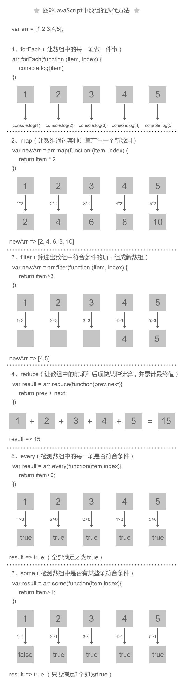

### 假设我们有一个数组，每个元素是一个人。你面前站了一排人。foreach 就是你按顺序一个一个跟他们做点什么，具体做什么，随便:
```js
people.forEach(function (dude) {
  dude.pickUpSoap();
});
```
### map 就是你手里拿一个盒子（一个新的数组），一个一个叫他们把钱包扔进去。结束的时候你获得了一个新的数组，里面是大家的钱包，钱包的顺序和人的顺序一一对应。
```js
var wallets = people.map(function (dude) {
  return dude.wallet;
});
```
### reduce 就是你拿着钱包，一个一个数过去看里面有多少钱啊？每检查一个，你就和前面的总和加一起来。这样结束的时候你就知道大家总共有多少钱了。
```js
var totalMoney = wallets.reduce(function (countedMoney, wallet) {
  return countedMoney + wallet.money;
}, 0);
```
### 补充一个 filter 的：你一个个钱包数过去的时候，里面钱少于 100 块的不要（留在原来的盒子里），多于 100 块的丢到一个新的盒子里。这样结束的时候你又有了一个新的数组，里面是所有钱多于 100 块的钱包：
```js
var fatWallets = wallets.filter(function (wallet) {
  return wallet.money > 100;
});
```
### 最后要说明一点这个类比和实际代码的一个区别，那就是 map 和 filter 都是 immutable methods，也就是说它们只会返回一个新数组，而不会改变原来的那个数组，所以这里 filter 的例子是和代码有些出入的（原来的盒子里的钱包减少了），但为了形象说明，大家理解就好。
### map、filter的作用都是产生一个新的数组，map产生的数组相对于原数组来说，数组项的value发生变化，而filter则是数组的项数发生变化。因此在确定使用场景的时候，如果我们需要产生一个新的数组，让数组项的值发生变化，那就用map,如果我们想筛选出数组的某些项，那么显然就用filter。而reduce则用的是递归的思想，对数组执行累加器的处理。

```js
Array.prototype.map = function (fn) {
    var resultArray = [];
    for (var i = 0,len = this.length; i < len ; i++) {
         resultArray[i] = fn.apply(this,[this[i],i,this]);
    }
    return resultArray;
}

Array.prototype.forEach = function (fn) {
    for (var i = 0,len = this.length; i < len ; i++) {
         fn.apply(this,[this[i],i,this]);
    }
}

Array.prototype.reduce= function (fn) {
    var formerResult = this[0];
    for (var i = 1,len = this.length; i < len ; i++) {
         formerResult = fn.apply(this,[formerResult,this[i],i,this]);
    }
    return formerResult;
}
```

